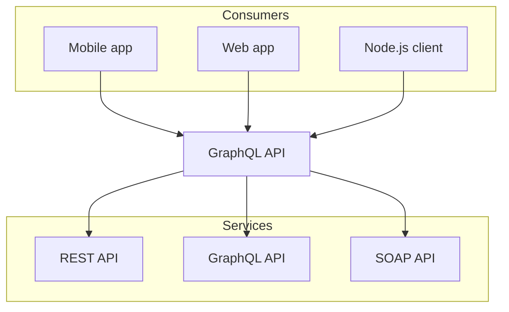

import { Callout } from "@/nextra/callout"
import { Screenshot } from "@/nextra/screenshot"
import titleSuffixImage from "../public/title-suffix.png"
import { Steps } from "@/nextra/steps"
import { Tree, Folder, File } from "@/nextra/file-tree"

## Example

<Tree>
  <Folder name="users-service" defaultOpen>
    <File name="schema.graphql" />
  </Folder>
  <Folder name="posts-service" defaultOpen>
    <File name="schema.graphql" />
  </Folder>
</Tree>



<Callout>
  If you want to use GraphQL API or libs like Axios, you can create your own fetcher function. Check
  [here](/docs/data-fetching) for more examples.
</Callout>

## Usage

````mdx filename="Markdown"

````

# LaTeX

Detailed information for each option is listed below.

import { OptionTable } from "@/nextra"

## Global

<Tree>
  <Folder name="users-service" defaultOpen>
    <File name="schema.graphql" />
    <Folder name="posts-service" defaultOpen>
      <File name="schema.graphql" />
    </Folder>
  </Folder>
</Tree>

This is some **bold** and _italics_ text.

This is a list in markdown:

- One
- Two
- Three

Checkout my React component:

# Getting Started

```css filename="CSS" word-wrap=false
html {
  background: red;
}
```

```graphql filename="GraphQL"
type Character {
  name: String
}
```

```python filename="Python"
# type Character {
class Character:
  # name: String
  def name(self):
    return self._name
```

```csharp filename="C#"
// type Character {
public class Character {
  // name: String
  public String Name { get; }
}
```

### Docs Repository

Set the repository URL of the documentation. It’s used to generate the
“[Edit this page](#edit-link)” link and the “[Feedback](#feedback-link)” link.

<OptionTable options={[["docsRepositoryBase", "string", "URL of the documentation repository."]]} />

#### Specify a Path

If the documentation is inside a monorepo, a subfolder, or a different branch of
the repository, you can simply set the `docsRepositoryBase` to the root path of
the `pages/` folder of your docs. For example:

```js
export default {
  docsRepositoryBase: "https://github.com/shuding/nextra/tree/main/docs",
}
```

Then Nextra will automatically generate the correct file path for all pages.

### Strikethrough

~~removed~~

```md filename="Markdown"
~~removed~~
```

### Task List

- [x] Write the press release
- [ ] Update the website
- [ ] Contact the media

```md filename="Markdown"
- [x] Write the press release
- [ ] Update the website
- [ ] Contact the media
```

### Table

| Syntax        | Description |   Test Text |
| :------------ | :---------: | ----------: |
| Header        |    Title    | Here's this |
| Paragraph     |    Text     |    And more |
| Strikethrough |             |    ~~Text~~ |

```md filename="Markdown"
| Syntax        | Description |   Test Text |
| :------------ | :---------: | ----------: |
| Header        |    Title    | Here's this |
| Paragraph     |    Text     |    And more |
| Strikethrough |             |    ~~Text~~ |
```

### Autolinks

Visit https://nextjs.org.

```md
Visit https://nextjs.org.
```

### SEO Options

You can configure SEO related settings via the `useNextSeoProps` option. The
`useNextSeoProps` function returns the props that will be passed to the
[Next SEO](https://github.com/garmeeh/next-seo#add-seo-to-page) component.

It is also a hook, so you can use APIs like `useRouter` inside to return values
conditionally.

<OptionTable
  options={[["useNextSeoProps", "() => NextSeoProps", "A React hook function that returns options for Next SEO."]]}
/>

For example, we can have all pages rendering the same suffix for `<title>`:

<Screenshot src={titleSuffixImage} alt="Title suffix" />

```js
export default {
  useNextSeoProps() {
    return {
      titleTemplate: "%s – SWR",
    }
  },
}
```

The `%s` is a [placeholder](https://github.com/garmeeh/next-seo#title-template)
that will be replaced by the page title.

You can also return it conditionally to avoid adding the suffix to the homepage:

```js
import { useRouter } from "next/router"

export default {
  useNextSeoProps() {
    const { asPath } = useRouter()
    if (asPath !== "/") {
      return {
        titleTemplate: "%s – SWR",
      }
    }
  },
}
```

<div className="mt-8 text-center text-sm">
  [Live example on StackBlitz ↗](https://stackblitz.com/edit/nextra-2-docs-yrlccm?file=theme.config.jsx)
</div>

```jsx
export default {
  logo: (
    <>
      <svg width="24" height="24" viewBox="0 0 24 24">
        <path
          fill="currentColor"
          d="M14.683 14.828a4.055 4.055 0 0 1-1.272.858a4.002 4.002 0 0 1-4.875-1.45l-1.658 1.119a6.063 6.063 0 0 0 1.621 1.62a5.963 5.963 0 0 0 2.148.903a6.035 6.035 0 0 0 3.542-.35a6.048 6.048 0 0 0 1.907-1.284c.272-.271.52-.571.734-.889l-1.658-1.119a4.147 4.147 0 0 1-.489.592z M12 2C6.486 2 2 6.486 2 12s4.486 10 10 10s10-4.486 10-10S17.514 2 12 2zm0 2c2.953 0 5.531 1.613 6.918 4H5.082C6.469 5.613 9.047 4 12 4zm0 16c-4.411 0-8-3.589-8-8c0-.691.098-1.359.264-2H5v1a2 2 0 0 0 2 2h2a2 2 0 0 0 2-2h2a2 2 0 0 0 2 2h2a2 2 0 0 0 2-2v-1h.736c.166.641.264 1.309.264 2c0 4.411-3.589 8-8 8z"
        />
      </svg>
      <span style={{ marginLeft: ".4em", fontWeight: 800 }}>My Cool Project</span>
    </>
  ),
}
```

### Project Link

Show a button that links to your project’s homepage on the navbar. By default,
it links to Nextra’s GitHub repository.

<OptionTable
  options={[
    ["project.link", "string", "URL of the project homepage."],
    ["project.icon", "React.ReactNode | React.FC", "Icon or element of the project link."],
  ]}
/>

You can configure `project.link` and `project.icon` to customize the project
link, for example make it link to your GitLab repository:

<Screenshot src={titleSuffixImage} alt="Project link" full />

```jsx
export default {
  project: {
    link: "https://gitlab.com/inkscape/inkscape",
    icon: (
      <svg width="24" height="24" viewBox="0 0 256 256">
        <path
          fill="currentColor"
          d="m231.9 169.8l-94.8 65.6a15.7 15.7 0 0 1-18.2 0l-94.8-65.6a16.1 16.1 0 0 1-6.4-17.3L45 50a12 12 0 0 1 22.9-1.1L88.5 104h79l20.6-55.1A12 12 0 0 1 211 50l27.3 102.5a16.1 16.1 0 0 1-6.4 17.3Z"
        ></path>
      </svg>
    ),
  },
}
```

If `icon` is missing, it will be a
[GitHub icon](https://primer.style/octicons/mark-github-16) by default.

### Chat Link

Show a button that links to your project’s forum or other social media on the
navbar.

<OptionTable
  options={[
    ["chat.link", "string", "URL of the chat link."],
    ["chat.icon", "React.ReactNode | React.FC", "Icon or element of the chat link."],
  ]}
/>

You can configure `chat.link` and `chat.icon` to customize the chat link, for
example make it link to your Twitter account:

```jsx
export default {
  chat: {
    link: "https://twitter.com/shuding_",
    icon: (
      <svg width="24" height="24" viewBox="0 0 248 204">
        <path
          fill="currentColor"
          d="M221.95 51.29c.15 2.17.15 4.34.15 6.53 0 66.73-50.8 143.69-143.69 143.69v-.04c-27.44.04-54.31-7.82-77.41-22.64 3.99.48 8 .72 12.02.73 22.74.02 44.83-7.61 62.72-21.66-21.61-.41-40.56-14.5-47.18-35.07a50.338 50.338 0 0 0 22.8-.87C27.8 117.2 10.85 96.5 10.85 72.46v-.64a50.18 50.18 0 0 0 22.92 6.32C11.58 63.31 4.74 33.79 18.14 10.71a143.333 143.333 0 0 0 104.08 52.76 50.532 50.532 0 0 1 14.61-48.25c20.34-19.12 52.33-18.14 71.45 2.19 11.31-2.23 22.15-6.38 32.07-12.26a50.69 50.69 0 0 1-22.2 27.93c10.01-1.18 19.79-3.86 29-7.95a102.594 102.594 0 0 1-25.2 26.16z"
        />
      </svg>
    ),
  },
}
```

If `icon` is missing, it will be a Discord icon by default.

### Menu and Custom Links

Check out [Page Configuration](/docs/docs-theme/page-configuration#navbar-items)
to learn how to add custom menus or links to the navbar.

### Search

<OptionTable
  options={[
    [
      "search.component",
      `React.ReactNode | React.FC<{
  className?: string
  directories: Item[]
}>`,
      "",
    ],
    ["search.emptyResult", "React.ReactNode | React.FC", "Not found text"],
    ["search.loading", "React.ReactNode | React.FC", "Loading text"],
    ["search.error", "string | (() => string)", "Error text"],
    ["search.placeholder", "string | (() => string)", "Placeholder text"],
  ]}
/>

### Banner

Show a banner on the top of the website. It can be used to show a warning or a
notice.

<OptionTable
  options={[
    ["banner.dismissible", "boolean", "Closable banner or not."],
    ["banner.key", "string", "Storage key to keep the banner state (dismissed or not)."],
    ["banner.text", "React.ReactNode | React.FC", "Text of the banner."],
  ]}
/>

#### Banner key

A banner can be dismissed. By default `banner.key` will be `"nextra-banner"` and
it’s used by
[localStorage](https://developer.mozilla.org/en-US/docs/Web/API/Window/localStorage)
to keep the banner state (dismissed or not) on the client.

If you have updated your banner text, you should change the key to make sure the
banner is shown again. The best practice is to always use a descriptive key for
the current text, for example:

<Screenshot src={titleSuffixImage} alt="Banner" />

```jsx
export default {
  banner: {
    key: "2.0-release",
    text: (
      <a href="https://nextra.site" target="_blank">
        🎉 Nextra 2.0 is released. Read more →
      </a>
    ),
  },
}
```

### Customize the Navbar

Customize the entire navbar component.

<OptionTable
  options={[
    ["navbar.component", "React.ReactNode | React.FC<NavBarProps>", "Navbar component."],
    ["navbar.extraContent", "React.ReactNode | React.FC", "Display extra content after last icon."],
  ]}
/>

### Head Tags

Configure the `<head>` tags of the website. You can add meta tags, title,
favicon, etc.

<OptionTable
  options={[
    [
      "head",
      "React.ReactNode | React.FC",
      <>
        Component that renders the <code>{"<head>"}</code> content.
      </>,
    ],
  ]}
/>

Nextra uses [KaTeX](https://katex.org/) to render LaTeX expressions directly in MDX.
To enable LaTeX support, you must enable the `latex` option in your `next.config.js` file:

```js filename="next.config.js"
module.exports = require("nextra")({
  latex: true,
})
```

When enabled, KaTeX’s CSS and fonts will be automatically included in your site, and you can start writing math expressions in your MDX files. Using LaTeX within MDX is as simple as wrapping your expression in `$` or `$$`.

## Example

For example, the following Markdown code:

```md filename="page.mdx"
The **Pythagorean equation**: $a=\sqrt{b^2 + c^2}$.
```

will be rendered as:

<div className="mt-6 rounded-xl border border-gray-200 p-4 dark:border-gray-900">
  The **Pythagorean equation**: $a=\sqrt{b ^ (2 + c) ^ 2}$.
</div>

You can still use [Markdown and MDX syntax](../markdown) in the same line as your LaTeX expression.

<Callout>
  If you want to display `$` in your content instead of rendering it as an equation, you can escape it with a backslash
  (`\`). For example `\$e = mc^2\$` will be rendered as \$e = mc^2\$.
</Callout>

## API

To learn more about KaTeX and its supported functions and conventions, visit [KaTeX’s documentation](https://katex.org/docs/supported.html).
